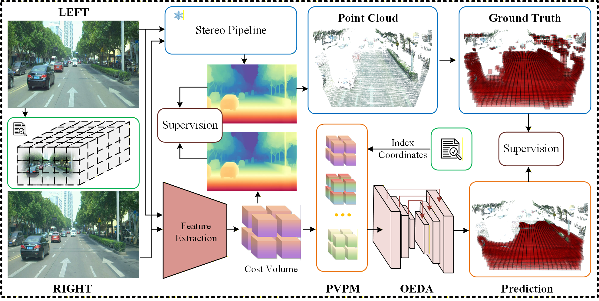

# SVRS



##  🌼 Abstract
Three-dimensional voxel reconstruction based on stereo vision is essential for environmental perception in autonomous robots. Existing pseudo-LiDAR methods recover voxel grids by estimating depth maps and projecting them pixel by pixel, leading to high computational cost and boundary over-smoothing. To overcome these issues, we model the inverse relationship between 2D pixels and 3D voxel grids and propose a Self-supervised 3D Voxel Reconstruction network from Stereo vision (SVRS). Specifically, we represent a given 3D scene as multi-scale uniform cubic voxel grids and introduce. PVPM projects the 3D position of each voxel grids into index coordinates, which establishes implicit stereo–voxel correspondences and converts dense pixel features into sparse voxel representations. Furthermore, we explore an Octree-based Encoder-Decoder Architecture (OEDA) to reconstruct multi-scale voxel grids via hierarchical spatial partitioning, avoiding the influence of dense empty grids on sparse occupied grids from coarse-to-fine. Finally, SVRS leverages off-the-shelf stereo matching methods within a self-supervised training framework. Experiments on the DrivingStereo dataset show that SVRS achieves competitive reconstruction accuracy while improving inference speed by up to 14× over advanced pseudo-LiDAR approaches and 3× over real-time stereo methods.

## :art: Visualization results.


## ⚙️ Installation
The code is tested on following libraries. Libraries with other versions might also work, but not guaranteed:

* Ubuntu 20.04
* Python 3.8
* PyTorch 1.11.0
* CUDA 11.7

## Dataset

### DrivingStereo
SVRS is trained and evaluated using [DrivingStereo](https://drivingstereo-dataset.github.io/) dataset. Please make sure to download their training and testing data and extract to any folder you prefer.

### Our Experiment
We provide the generated Ground Truth and checkpoints described in this paper.[https://pan.baidu.com/s/1jOjmO3d6xDitgQdMvzlNNA, Extraction Code(yxw2)]

## Evaluation
The evaluation metrics are shown in the ".xls" file.


**Note:** If you want to reproduce the ".xls" file, you need to first download the link we provided and extract the relevant files.

Evaluation based on the stereo matching method
```
python evaluate-PLiDar.py
```
Evaluation based on the SVRS
```
python SVRS/evaluate.py
```


# Acknowledgements

```
This project is based on [StereoVoxelNet](https://github.com/RIVeR-Lab/stereovoxelnet.git), [RAFT-Stereo](https://github.com/princeton-vl/RAFT-Stereo), [IGEV](https://github.com/gangweiX/IGEV), and [Monster](https://github.com/Junda24/MonSter).
